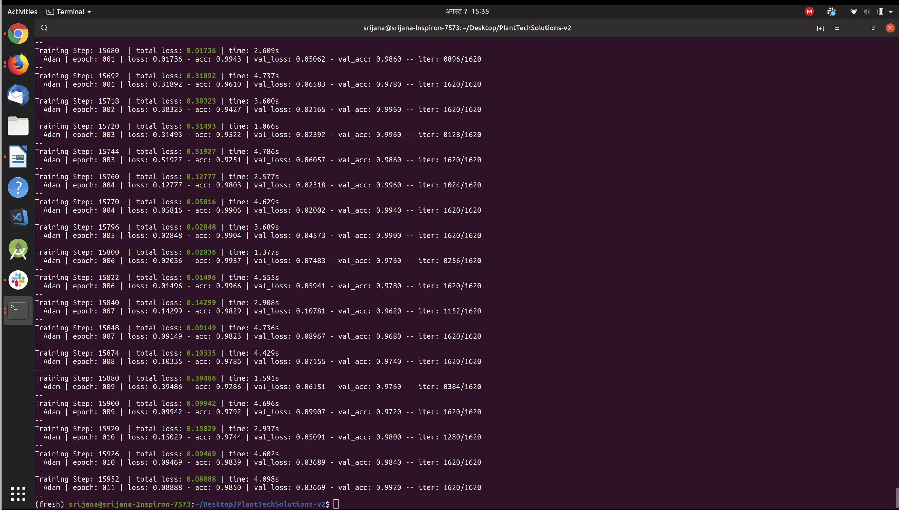
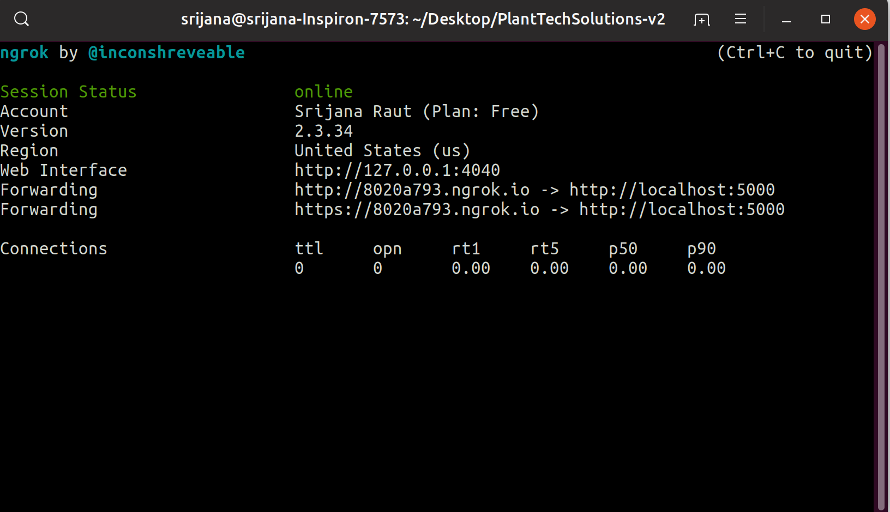

# Plant-Disease-Detection/Classification
Manually detection of plant disease is very difficult, costly and time consuming. Inaccuracy in identification of plant disease may cause the great loss in the production and economical value of market. Detection of plant disease may require huge amount of knowledge and work on plant disease. Therefore, we use the image processing technique for detection of plant’s leaf detection. . Then the result consisting of the disease name with the **accuracy** is retrieved using **CNN algorithm.**
## For this:
Install the **requirement.txt** file from the repo **Plant-Disease-Detection.** Then the python script as  [cnn.py](https://github.com/rautsrijana/Plant-Disease-Detection/blob/master/cnn.py) gives the real insight of **CNN algorithm** for taining your dataset. I had **train** the dataset from **kaggle** i.e [Rice Diseases Image Dataset](https://www.kaggle.com/minhhuy2810/rice-diseases-image-dataset#LabelledRice.zip)

### Results
**1. The uptodate accuracy of this model with convulation neural network algorithm is given below :**

**2. The local server connection through ngrok.This ngrok helps to connect the ML module with android application. For more details, you can visit [here](https://dashboard.ngrok.com/get-started)**

 
